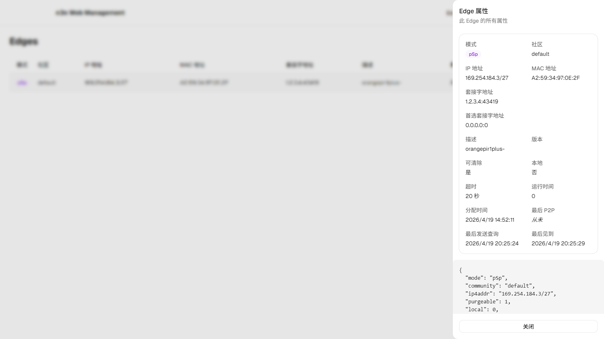
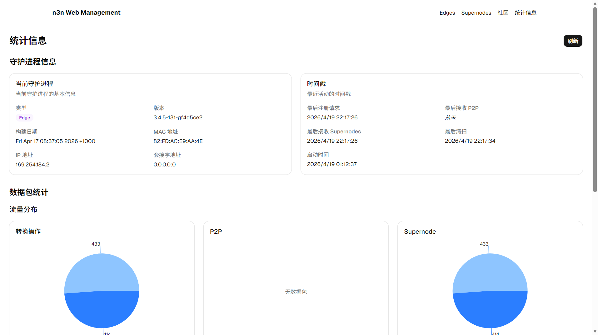

# n3n Web Management Tool

A comprehensive web management tool for n3n and n2n, built with React, shadcn/ui, and Vite.

## Features

- **Multi-page application** with React Router
- **shadcn/ui components** for modern UI
- **Network edges table** with real-time data
- **Supernodes table** with real-time data
- **Communities table** with real-time data
- **Network statistics** with charts and metrics
- **Responsive design** using Tailwind CSS
- **Error handling** with sonner toast notifications
- **Dark mode support** with automatic detection and keyboard shortcut (press <kbd>d</kbd> to toggle)
- **Internationalization (i18n)** support with English and Chinese (Simplified) translations

## Screenshots

### Edges Page


### Stats Page


## Installation

### Pre-built Release

1. **Download Frontend Artifact**
   - Go to [GitHub Actions Build Workflow](https://github.com/SerinaNya/n3n-web-mgmt/actions/workflows/build.yml)
   - Download the latest build artifact
   - Extract the contents to a `dist` folder

2. **Download Backend**
   - Download `n3n-mgmt-api-rs` backend from [GitHub Releases (_SerinaNya/n3n-mgmt-api-rs_)](https://github.com/SerinaNya/n3n-mgmt-api-rs/releases)

3. **Directory Structure**
   Ensure both the frontend and backend are in the same directory:

   ```
   ├── dist/              # Frontend files
   │   ├── index.html
   │   ├── assets/
   │   └── ...
   └── n3n-mgmt-api-rs    # Backend executable
   ```

4. **Run Backend**
   - Read the [README](https://github.com/SerinaNya/n3n-mgmt-api-rs#readme) for the backend
   - Execute the backend executable (`n3n-mgmt-api-rs`)

### From Source

See [Development](#development) and [Build for Production](#build-for-production) sections below.

## Project Structure

```
n3n-web-mgmt/
├── public/             # Static assets
│   └── vite.svg
├── screenshots/        # Screenshots for README
│   ├── edges-page.png
│   └── stats-page.png
├── src/
│   ├── assets/         # Project assets
│   │   └── react.svg
│   ├── components/     # React components
│   │   ├── ui/                # shadcn/ui components
│   │   ├── Navbar.tsx         # Navigation bar component
│   │   ├── RootLayout.tsx     # Root layout component
│   │   ├── TimeAgo.tsx        # Time ago component
│   │   └── theme-provider.tsx # Theme provider component
│   ├── i18n/           # Internationalization files
│   │   ├── en.json            # English translations
│   │   ├── zh-CN.json         # Chinese (Simplified) translations
│   │   └── index.ts           # i18n configuration
│   ├── lib/            # Utility functions
│   │   └── utils.ts            # Utility functions
│   ├── pages/          # Page components
│   │   ├── HomePage.tsx       # Main landing page
│   │   ├── EdgesPage.tsx      # Network edges table page
│   │   ├── SupernodesPage.tsx # Supernodes table page
│   │   ├── CommunitiesPage.tsx # Communities table page
│   │   └── StatsPage.tsx      # Network statistics page
│   ├── routes/         # Router configuration
│   │   └── index.tsx          # Main router setup
│   ├── App.tsx         # Main App component
│   ├── index.css       # Global styles
│   └── main.tsx        # Client entry point
├── .gitignore          # Git ignore file
├── .prettierignore     # Prettier ignore file
├── .prettierrc         # Prettier configuration
├── components.json     # shadcn/ui configuration
├── eslint.config.js    # ESLint configuration
├── index.html          # HTML entry point
├── package.json        # Project dependencies
├── pnpm-lock.yaml      # pnpm lock file
├── pnpm-workspace.yaml # pnpm workspace configuration
├── tsconfig.app.json   # TypeScript app configuration
├── tsconfig.json       # TypeScript configuration
├── tsconfig.node.json  # TypeScript node configuration
├── vite.config.ts      # Vite configuration
└── README.md           # This file
```

## Getting Started

### Prerequisites

- Node.js 18+
- pnpm package manager
- n3n daemon running with management socket

### Development

1. Clone the repository
2. Install dependencies:

   ```bash
   pnpm install
   ```

3. Run the development server:

   ```bash
   pnpm run dev
   ```

### Build for Production

Build the application:

```bash
pnpm run build
```

The application will be available at http://localhost:5173 (development) or http://localhost:4173 (preview)

## Pages

- **Home Page**: Introduction to the n3n Web Management tool with navigation links
- **Edges Page**: Table displaying network edge nodes with real-time data
- **Supernodes Page**: Table displaying supernodes with real-time data
- **Communities Page**: Table displaying communities with real-time data
- **Stats Page**: Network statistics with charts and metrics

## Internationalization (i18n)

The application supports internationalization with English and Chinese translations. It uses `react-i18next` for translation management.

### Translation Files

Translation files are located in the `src/i18n/` directory:

- `en.json` - English translations
- `zh-CN.json` - Chinese (Simplified) translations

### Language Detection

The application automatically detects the user's browser language and sets the appropriate locale. If the detected language is not supported, it falls back to English.

### Adding New Translations

To add new translations, update the corresponding JSON files in the `src/i18n/` directory. Follow the existing structure and add new keys as needed.

## API Integration

The application connects to the n3n management API through the following endpoints:

- `/api/edges` - Get network edge nodes
- `/api/supernodes` - Get supernodes
- `/api/communities` - Get communities
- `/api/info` - Get daemon information
- `/api/timestamps` - Get recent activity timestamps
- `/api/packetstats` - Get packet statistics

## Error Handling

The application uses sonner toast notifications for error handling, providing a user-friendly way to display error messages when API requests fail.

## Future Enhancements

- Implement authentication
- Add real-time updates using WebSockets
- Add more configuration options
- Improve performance with code splitting